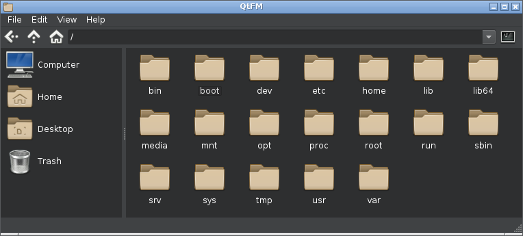

Lightweight desktop independent Qt file manager for Linux, FreeBSD, NetBSD, OpenBSD and macOS.

 * Desktop (theme/applications/mime) integration
 * Customizable interface
 * Powerful custom command system
 * Customizable key bindings
 * Drag & drop functionality
 * Tabs
 * Removable device support
 * System tray daemon
